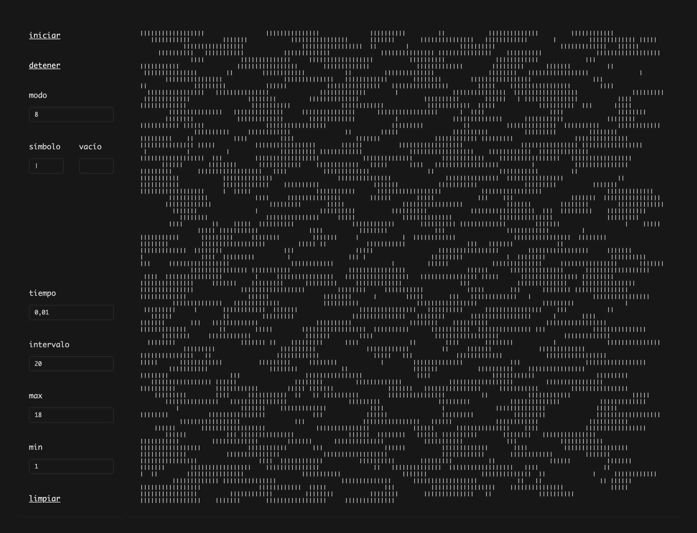

## Arte generativo: ruido visual

Experimentos con R para generar ruido visual mediante la generación de texto ASCII en la consola.

Publicación en mi blog demostrando el fenómeno: <https://bastianolea.rbind.io/blog/2025-08-27/>

### Scripts
- `ascii_rayas.R`: varios modos de llenar la consola con texto algorítmico que produce patrones visuales interesantes

### Apps
- `/app/`: aplicación Shiny que usa algunos modos de generación de ruido visual en vivo, con algunos controles para personalizar el output. Funciona ejecutando la función del script `generadores.R` en el fondo con `{callr}` que imprime los patrones en tiempo real en un archivo de texto, mientras que Shiny lee el archivo de texto cada _x_ milisegundos.
